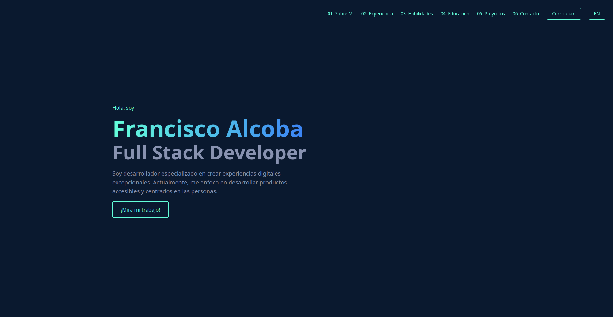

# Portfolio Personal - Francisco Alcoba



## 🚀 Descripción

Portfolio personal desarrollado con tecnologías modernas que muestra mi experiencia profesional, habilidades técnicas y proyectos. Diseñado con un enfoque en la experiencia del usuario, animaciones suaves y un diseño responsivo.

## ✨ Características

- 🌍 Soporte multiidioma (Español e Inglés)
- 📱 Diseño totalmente responsivo
- 🎨 Interfaz moderna con animaciones suaves
- 🌙 Diseño oscuro para mejor legibilidad
- 🎯 Secciones organizadas para fácil navegación

## 🛠️ Tecnologías Utilizadas

### Frontend
- Vue.js 3 - Framework JavaScript progresivo
- Vue Router - Enrutamiento oficial de Vue.js
- Vue I18n - Internacionalización
- Tailwind CSS - Framework CSS utilitario
- PostCSS - Procesador CSS

### Herramientas de Desarrollo
- Vue CLI - Herramienta estándar de desarrollo para Vue.js
- ESLint - Linter de código JavaScript
- Git - Control de versiones

## 📦 Instalación

1. Clona el repositorio:
```bash
git clone https://github.com/FranAlcoba66/portfolio.git
```

2. Instala las dependencias:
```bash
cd portfolio
npm install
```

3. Inicia el servidor de desarrollo:
```bash
npm run serve
```

## 🚀 Despliegue

Para construir el proyecto para producción:
```bash
npm run build
```

## 🏗️ Estructura del Proyecto

```
src/
├── assets/          # Recursos estáticos (imágenes, CSS)
├── components/      # Componentes Vue reutilizables
├── i18n/           # Archivos de traducción
├── router/         # Configuración de rutas
├── store/          # Estado global (Vuex)
└── views/          # Vistas/páginas principales
```

## 📱 Componentes Principales

- `Navbar` - Barra de navegación responsiva
- `Hero` - Sección de presentación principal
- `About` - Información personal y profesional
- `Experience` - Experiencia laboral
- `Education` - Formación académica
- `Skills` - Habilidades técnicas
- `Projects` - Proyectos destacados
- `Contact` - Información de contacto

## 🌍 Idiomas Soportados

- Español (es)
- Inglés (en)

## 📫 Contacto

- Email: franciscoadrianalcoba@gmail.com
- LinkedIn: [Francisco Adrian Alcoba](https://www.linkedin.com/in/francisco-adrian-alcoba/)
- GitHub: [FranAlcoba66](https://github.com/FranAlcoba66)

## 📄 Licencia

Este proyecto está bajo la Licencia MIT - ver el archivo [LICENSE](LICENSE) para más detalles.
